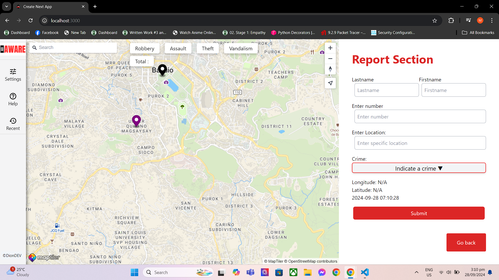

# GeoAWARE

Short project description – An Application for Reporting and mapping out Crimes


## Table of Contents

1. Project Overview
2. Tech Stack
3. Features
4. Getting Started
5. Installation
6. Usage
7. API Documentation
8. Environment Variables
9. Folder Structure
10. Testing
11. Contributing
12. License
13. Contact Information

## Project Overview

- **Purpose**: The goal is to give people a sense of security and collaborate with each other whenever they are navigating through unknown places. It allows users to avoid or be cautious about their places.
- **Goal**: This is to provide fast and updated reports whenever a crime happens. It alerts everyone that uses the web application, allowing users to be confident about places they don’t know.
- **Demo**: 

## Tech Stack

### Frontend

- Framework/Library: Next.js and TypeScript
- Styling: Tailwind CSS
- State Management: 
    1. The application uses **Next.js**'s built-in features for server-side rendering (SSR) and static site generation (SSG).
    2. Data fetching is handled via **`fetch`** for API requests.
    3. State is managed locally within components, using React's built-in hooks such as `useState` and `useEffect`.

### Backend

- Language: Node.js
- Framework: Express
- Database: PostgreSQL

### Other Technologies

- Authentication: OAuth, Passport, Local passport
- Hosting: N/A
- Version Control: Git Bash, GitHub

## Features
List the key features of your application:

- Feature 1: Report in Realtime
- Feature 2: Mapout Crimes
- Feature 3: View Recent Reports

## Getting Started
### Prerequisites

- Language: Node.js
- Database: PostgreSQL
- Framework: Next.js

## Installation
1. Clone the repository:
    git clone https://github.com/username/repo-name.git

2. Navigate to the project directory:
    Server: 
        cd /server
    Client: 
        cd /client

3. Install dependencies:
    Server: 
        npm install
    Client: 
        npm install

4. Set up the database
    ```sql
    CREATE TABLE user_report (
        lastname character varying(45),
        firstname character varying(45),
        phone_number character varying(20),
        latitude numeric(9,6),
        longitude numeric(9,6),
        id serial PRIMARY KEY,
        crime character varying(45),
        location text,
        event_date timestamp without time zone
    );

    CREATE TABLE users (
        id serial PRIMARY KEY,
        username character varying(45),
        email character varying(45),
        password text
    );

5. Set up environment variables
- **Backend**:
  - Postgres Configuration
  - Cookie Values
  - Cookie Secret
  - Session Secret

- **Frontend**:
  - Maptiler API keys

6. Include code formatting for the package.json scripts:
    "scripts": {
        "dev": "nodemon server.js",
        "start": "node server.js"
    }

7. Run the application for both Frontend & Backend:
    npm run dev


## API Documentation

### Frontend
    /: MainPage
    /Authentication: Users Login/Register Section

### Backend
    /api/users
        POST   /signup: Signup users 
        POST   /login: Login users
        POST   /logout: Logout users

    /api/maps
        GET /crime-layout: Gets all reports
        POST /geoaware/:id: Take and Validate Reports by user

## Contributing
Open for Collaboration. You can sent through email.

- Fork the repository.
- Create a new branch (git checkout -b feature-branch).
- Commit your changes (git commit -m 'Add new feature').
- Push to the branch (git push origin feature-branch).
- Open a Pull Request.

## Contact Information
- Dionell
- manahandionell1@gmail.com
- [Github](https://www.linkedin.com/feed/)
- [Linkin](https://www.linkedin.com/feed/)